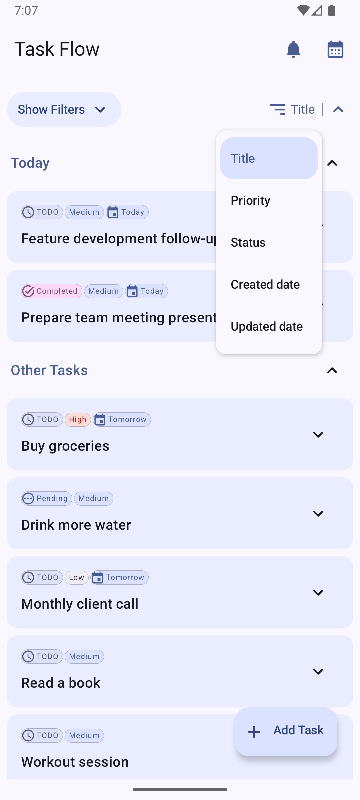
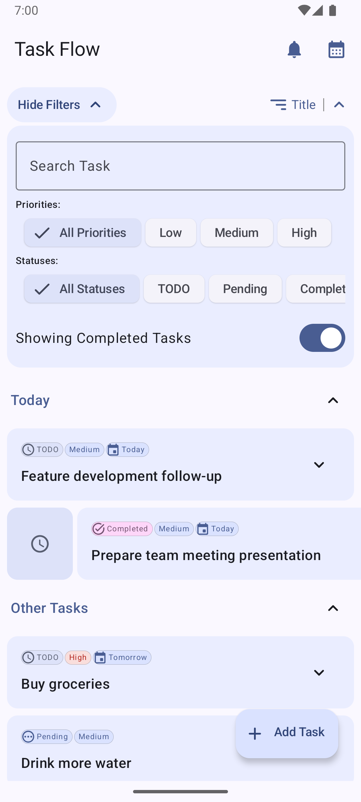
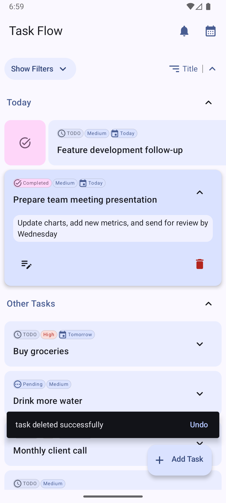
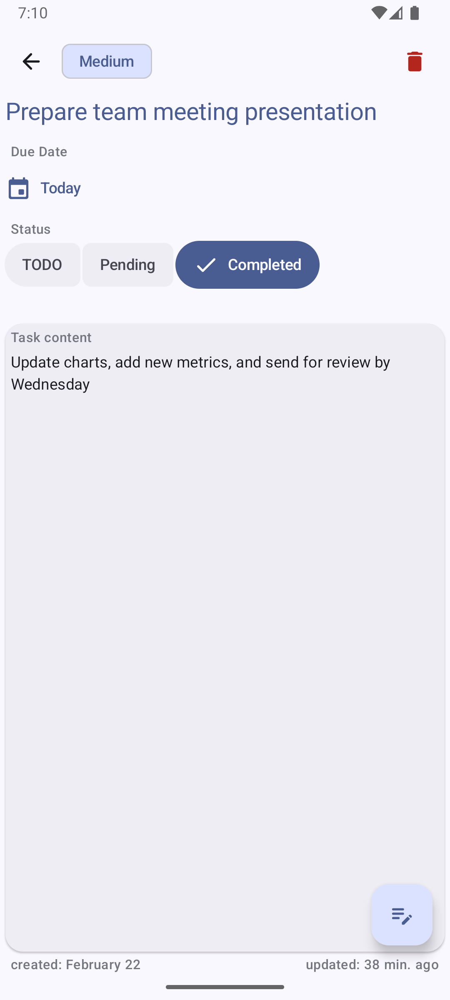
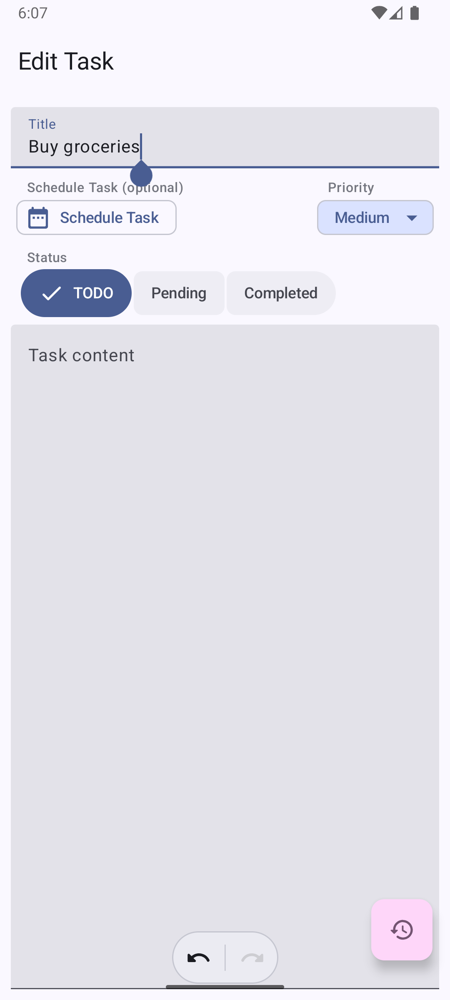
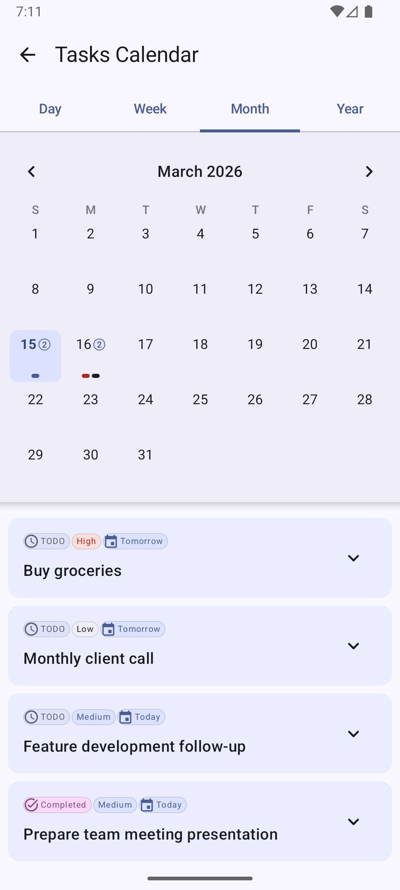
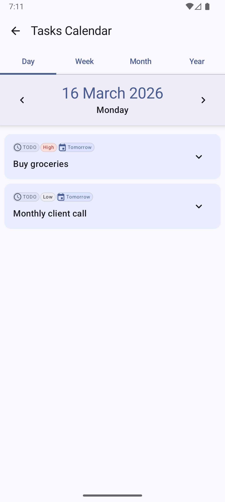
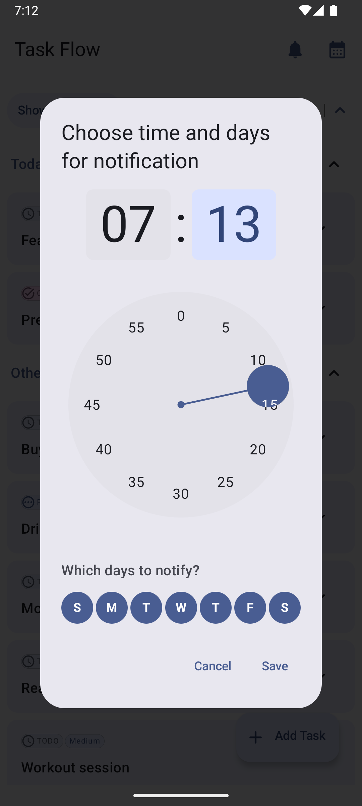

<div align="center">


# TaskFlow

**A Modern, Clean, and Intuitive Android Task Management Application**

[](#)
[](#)
[](#)
[](#)
[](#)

TaskFlow is built to demonstrate modern Android development best practices, featuring a fully declarative UI, robust local storage, background processing, and a highly scalable architecture.

[Explore Features](#-features) • [View Screenshots](#-screenshots) • [Tech Stack](#-tech-stack) • [Getting Started](#-getting-started)

</div>

---

## ✨ Features

### 🎯 Core Task Management
* **Create & Edit:** Seamlessly add, update, and categorize tasks.
* **Quick Swipe Actions:** Easily swipe on any task to instantly toggle its status between **Completed** and **TODO**.
* **Smart Search & Filtering:** Find tasks instantly using the real-time search bar, or filter them by **Status** (Done, Pending) and **Priority** (High, Medium, Low).
* **Sorting Options:** Keep things organized by sorting tasks by Date or Title.
* **Undo/Redo:** Built-in history management when editing tasks to prevent accidental data loss.

### 📅 Advanced Calendar Views
* Navigate your schedule with dynamic calendar integration.
* Switch effortlessly between **Daily**, **Weekly**, **Monthly**, and **Yearly** perspectives.

### 🔔 Background & System Integrations
* **Daily Notifications:** Never miss a task! Powered by `WorkManager` and `AlarmManager` for reliable, scheduled reminders. You can configure the exact notification time.
* **Boot Receiver:** Automatically reschedules notifications when the device reboots.
* **User Preferences:** Saves user settings (like notification times and sorting preferences) safely using `DataStore Preferences`.

### 🎨 Modern UI/UX
* **Material Design 3:** Beautiful, responsive, and intuitive interface.
* **Dark/Light Theme:** Full support for system-wide dark and light modes.

---

## 📸 Screenshots

<div align="center">
  <table>
    <tr>
      <td align="center"><b>Home - Sorting</b></td>
      <td align="center"><b>Home - Filters</b></td>
      <td align="center"><b>Swipe Actions & Undo</b></td>
      <td align="center"><b>Task Details</b></td>
    </tr>
    <tr>
      <td></td>
      <td></td>
      <td></td>
      <td></td>
    </tr>
    <tr>
      <td align="center"><b>Add/Edit Task</b></td>
      <td align="center"><b>Calendar - Month View</b></td>
      <td align="center"><b>Calendar - Day View</b></td>
      <td align="center"><b>Notification Settings</b></td>
    </tr>
    <tr>
      <td></td>
      <td></td>
      <td></td>
      <td></td>
    </tr>
  </table>
</div>

---

## 🛠 Tech Stack & Architecture

This project strictly follows **Clean Architecture** principles (Data, Domain, and Presentation layers) along with the **Unidirectional Data Flow (UDF)** and **MVVM** patterns.

### UI & Presentation
* **Jetpack Compose:** For building a declarative and reactive UI.
* **Material 3:** For modern UI components and theming.
* **Compose Navigation:** Type-safe navigation between screens.
* **ViewModel:** Lifecycle-aware state management.

### Domain & Business Logic
* **Kotlin Coroutines & Flows:** For asynchronous programming and reactive data streams.
* **Use Cases:** Encapsulating specific business rules (e.g., `GetFilteredTasks`, `InsertTask`).

### Data & Local Storage
* **Room Database:** Local SQLite database mapping for offline task storage.
* **DataStore Preferences:** Asynchronous preference saving (replacing SharedPreferences).
* **Dagger Hilt:** Dependency Injection to ensure components are decoupled and testable.

### Background Processing
* **WorkManager:** For deferrable, guaranteed background work (e.g., DailyTaskWorker).
* **Broadcast Receivers:** For handling system events like boot completed and alarms.

---

## 🚀 Getting Started

To get a local copy up and running, follow these simple steps.

### Prerequisites
* **Android Studio** (Koala or newer recommended)
* **JDK 17**
* Minimum Android SDK: **API 29** (Android 10)

### Installation
1. Clone the repository:
   ```bash
   git clone [https://github.com/jacobel640/taskflow.git](https://github.com/jacobel640/taskflow.git)
   ```
2. Open the project in **Android Studio**.
3. Let Gradle complete the sync and download all necessary dependencies.
4. Build and run the app on an emulator or a physical Android device.

---

## 🤝 Contributing

Contributions are what make the open-source community such an amazing place to learn, inspire, and create. Any contributions you make are **greatly appreciated**.

1. Fork the Project
2. Create your Feature Branch (`git checkout -b feature/AmazingFeature`)
3. Commit your Changes (`git commit -m 'Add some AmazingFeature'`)
4. Push to the Branch (`git push origin feature/AmazingFeature`)
5. Open a Pull Request

## 📄 License

Distributed under the MIT License. See `LICENSE` for more information.
